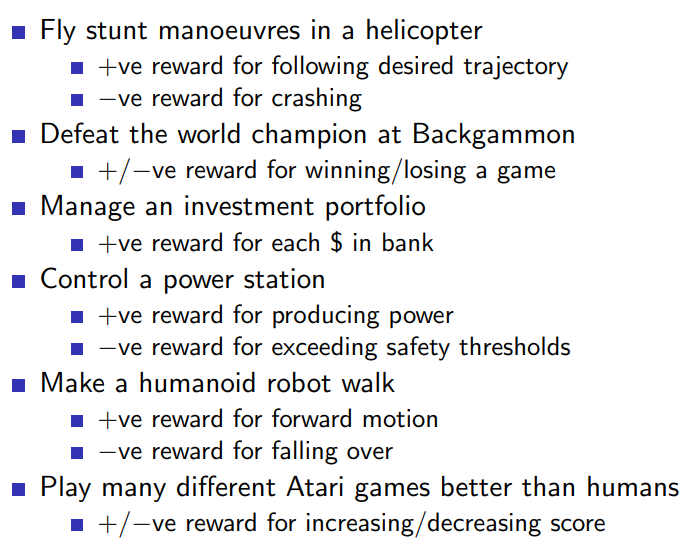
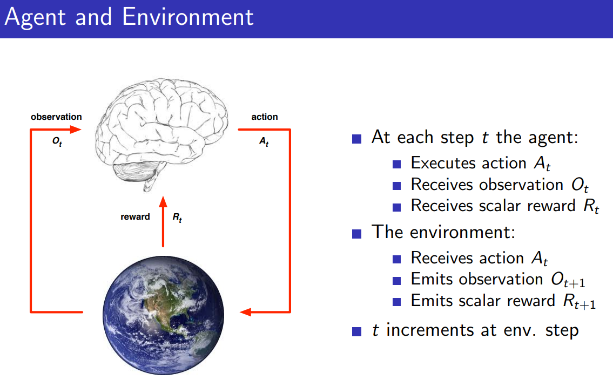
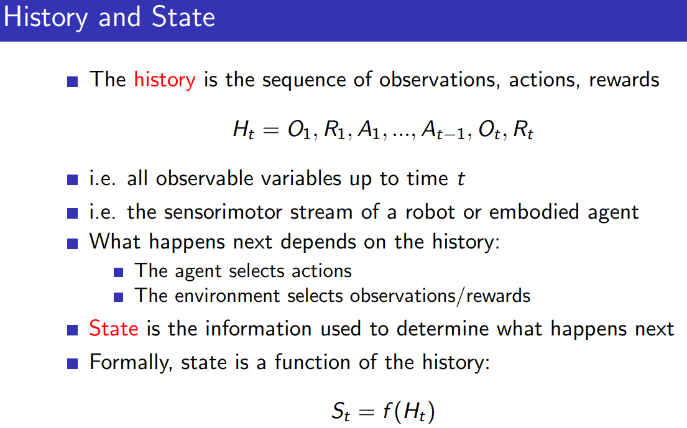
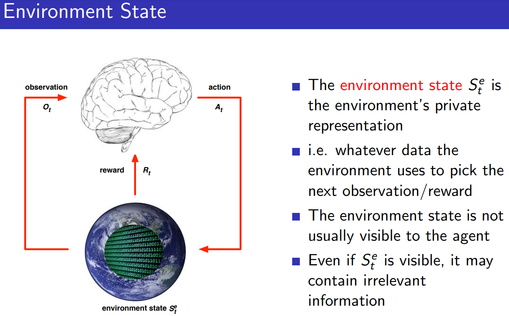

# Outline
1. About Reinforcement Learning
2. The Reinforcement Learning Problem
3. Inside an RL Agent
4. Problems with Reinforcement Learning
# About Reinforcement Learning
### Many Faces of Reinforcement Learning

1. **Reinforcement Learning as a Cross-Disciplinary Field**
    
    - RL is a central topic that connects various scientific domains.
    - It is fundamentally about **decision-making**, making it applicable across multiple areas.
2. **Connections to Other Fields:**
    
    - **Computer Science:** RL is a subset of **machine learning**, where algorithms learn to make optimal decisions based on rewards.
    - **Engineering:** RL overlaps with **optimal control**, which focuses on determining the best sequence of actions to achieve desired outcomes.
    - **Neuroscience:**
        - The **dopamine system** in the human brain closely mirrors RL algorithms.
        - Research suggests that RL principles underlie human decision-making processes.
    - **Psychology:**
        - Concepts like **classical conditioning** (Pavlov) and **operant conditioning** (Skinner) align with RL, explaining how behaviors emerge through reinforcement.
    - **Mathematics:** RL has strong ties to **operations research** and **optimal control theory**, where mathematical models optimize decisions.
    - **Economics:**
        - RL is linked to **game theory**, **utility theory**, and **bounded rationality**, which explore decision-making strategies under constraints.
3. **The Fundamental Nature of Reinforcement Learning**
    
    - RL is a **universal framework for decision-making** across disciplines.
    - The study of RL helps understand how both artificial systems and biological organisms make decisions to maximize rewards.

### Branches of Machine Learning

### Characteristics of Reinforcement Learning

1. **No Supervisor in Reinforcement Learning**
    
    - Unlike **Supervised Learning**, where a model is provided with labeled data that explicitly states the correct answer, RL lacks direct supervision.
    - Instead of receiving explicit guidance on what action to take, an RL agent learns through **trial and error**, exploring the environment autonomously.
    - The agent receives only a **reward signal** that indicates whether an action was beneficial or harmful but does not specify the best possible action.
    - Example: Instead of being told “Turn left,” an agent might receive a reward of **+3 points** for a correct move or **-10 points** for a mistake, but it has to figure out why.
2. **Delayed Feedback**
    
    - In **Supervised Learning**, feedback is immediate—errors in prediction are corrected instantly based on labeled data.
    - In **RL**, feedback (i.e., rewards or penalties) may come **many steps later**, making it harder to associate actions with their consequences.
    - Example: A chess-playing RL agent might make a move that seems good at the moment but only realizes much later that it was a mistake when it leads to checkmate.
3. **Sequential Decision-Making**
    
    - Unlike **Supervised Learning**, where each data point is independent (**IID - Independently and Identically Distributed**), RL involves **sequential** decisions where previous actions affect future ones.
    - The agent interacts with the environment **over time**, making decisions that influence subsequent states.
    - Example: A self-driving car must continuously make decisions about steering, acceleration, and braking, where each choice affects its future state.
4. **Non-IID Data and Correlated Observations**
    
    - In **Supervised Learning**, data is typically assumed to be IID (independent of other samples).
    - In RL, however, **each observation is correlated with previous ones**.
    - Example: If a robot is walking, what it sees in one moment is closely related to what it sees in the next second. This makes it difficult to use traditional learning assumptions.
5. **Agent Actively Influences the Data It Receives**
    
    - Unlike a passive machine learning model that learns from a fixed dataset, an RL agent **actively changes its environment** by taking actions.
    - The data it encounters depends on **what it has done previously**.
    - Example: If a robot moves to a different side of a room, it will see different objects, receive different rewards, and gather a **different dataset** from what it would have seen had it stayed in place.
6. **Active Learning and Optimization Over Time**
    
    - RL involves **active learning**, where the agent must explore different strategies before finding the most optimal one.
    - Instead of simply classifying images or predicting values, RL agents must **continuously improve** through experience, refining their strategy based on rewards received over time.
    - Example: A video game AI might initially make random moves but gradually learns the best tactics to maximize its score.
### Examples of Reinforcement Learning

1. **Helicopter Stunt Maneuvers:**
    
    - A helicopter performs complex stunts based on reinforcement learning.
    - There is no immediate feedback after every move, but success is determined at the end of the maneuver.
    - Crashing is considered a failure, reinforcing the need for precise learning.
2. **Backgammon AI Success:**
    
    - Jerry Taro’s RL model defeated the human world champion in Backgammon.
    - The AI learned to play by repeated trial and error, gradually improving its strategy.
3. **Investment Portfolio Management:**
    
    - An RL model makes real-time investment decisions based on incoming data.
    - The reward function is based on maximizing financial returns over time.
    - The model learns optimal investment strategies through experience.
4. **Power Station Control:**
    
    - RL optimizes control over a power station’s operation.
    - Adjustments include torque control, battery ratios, and blade pitch in wind turbines.
    - The objective is to maximize energy efficiency and output over time.
5. **Humanoid Robot Walking:**
    
    - A robot learns to walk using RL, receiving feedback on whether it falls or moves forward.
    - It refines its movement strategy step by step to reach a goal (e.g., crossing a room).
6. **DeepMind’s Atari Game Agent:**
    
    - A single RL-based agent learns to play multiple Atari games at a superhuman level.
    - The program adapts to different game environments by learning optimal strategies.

**Audience Questions and Lecturer's Response**
1. Question about **simulation in Reinforcement Learning**
	- Audience: Whether the helicopter reinforcement learning system was trained in a simulated environment
	- Lecturer: Approach involved first building a model of the helicopter's behavior using real-world data. The learning was then done offline using this model before being applied to the actual helicopter.
2. Question about **Atari Game Learning**
	- Audience: Inquires the reinforcement learning agent playing Atari games
	- Lecturer: The agent learns purely through trial and error. It has no prior knowledge of the game rules and only receives video input and score feedback. Through reinforcement learning, it figures out how to maximize the score without human guidance.
- Question about **Knowledge transfer between Atari games**
	- Audience: Whether knowledge transfer strategies is applied between Atari games
	- Lecturer: Each game starts fresh, with no knowledge transfer.

Reinforcement learning (RL) is not just about games, though many applications involve games. RL concepts are broadly applicable beyond gaming.
# The Reinforcement Learning Problem
In reinforcement learning (RL), one of the core concepts is the **reward**, which is a numerical feedback signal (Rt​) given at each time step 't' to indicate how well the agent is performing. The **agent's goal** is to maximize the total sum of rewards over time.

A fundamental hypothesis in RL is that **all goals can be framed as the maximization of expected cumulative reward**. This assumption underlies the entire RL framework, though it can be debated.

Key points:

- **Rewards define objectives**: If there are no intermediate rewards, the agent only receives a reward at the end of an episode.
- **Handling time-based goals**: If the goal is to achieve something in the shortest time, a common approach is to set a reward of -1 per time step, encouraging the agent to complete the task as quickly as possible.
### Examples of Rewards

- **Helicopter Stunts:** Positive rewards are given for following the desired trajectory or staying within a small radius of the target position. A large negative reward is assigned for crashing.
    
- **Backgammon:** No intermediate rewards are provided during the game. Only at the end is a reward given: positive for winning, negative for losing. The agent must learn to maximize these end-game rewards by making good decisions throughout the game.
    
- **Investment Portfolio:** The reward signal is straightforward: profit (dollars or pounds). The goal is to maximize the total accumulated profit.
    
- **Power Station Control:** Positive rewards are given for each unit of power produced. Negative rewards are assigned for exceeding safety thresholds or violating regulations.
    
- **Robot Walking:** Positive rewards are given for forward motion (distance traveled). A large negative reward is assigned for falling over.
    
- **Atari Games:** Rewards are based on score changes at each step. A positive reward is given for an increase in score, and presumably a negative reward for a decrease (though this isn't explicitly stated).

While these problems appear different, **the goal is to create a unified machine learning framework to handle them all with the same agents and concepts**. The first step is understanding the reward signal, which is received at each time step.
### Sequential Decision Making
- **Unified Framework** → Even though problems (e.g., financial investment, helicopter control, chess) seem different, they share a common structure: **making a sequence of decisions to maximize future rewards**.
- **Maximizing Total Future Reward** → The core idea is to choose actions that result in the highest long-term benefit, not just immediate gain.
- **Planning Ahead & Long-Term Consequences** →
    - **Non-Greedy Strategy**: Short-term sacrifices (e.g., spending money, refueling, defensive chess moves) may lead to better outcomes in the future.
    - **Delayed Reward**: The effect of an action may not be immediate but could influence rewards later.

- **Examples in RL:**

	- **Financial Investment**: Spend money now → Gain profits later.
	- **Helicopter Control**: Take a detour to refuel → Avoid crashing later.
	- **Chess**: Sacrificing a piece now → Achieve a stronger position later.

- **Reinforcement Learning Concepts Covered:**

	- **Agent**: The decision-maker (e.g., investor, pilot, chess player).
	- **Environment**: The world in which the agent operates (e.g., stock market, helicopter physics, chessboard).
	- **Actions**: Choices available to the agent.
	- **Reward**: Feedback received for taking an action.
	- **Policy**: The strategy for choosing actions to maximize future rewards.
### Environments

**1. The Agent**

- The **agent** is represented as a **"big brain"** that we are designing.
- It is the entity that **makes decisions and takes actions** in an environment.
- The goal of RL is to **build an algorithm** that acts as the brain of the agent.
- The agent could be:
    - A **robot** that controls motors.
    - A **trading algorithm** deciding investments.
    - A **game-playing AI** making strategic moves.

**2. The Agent’s Inputs and Outputs**

At each step, the agent:

1. **Receives an observation** – This is a snapshot of the world (e.g., a camera feed for a robot, a game screen for an AI playing Atari).
2. **Receives a reward** – A signal indicating how well the agent is performing.
3. **Takes an action** – Decides the next step based on observations and past experiences.

The agent must **learn** to take the best possible actions to maximize future rewards.

**3. The Environment**

- The **environment** is everything **outside** the agent that it interacts with.
- It could be:
    - The **real world** for a self-driving car.
    - A **stock market simulation** for a trading AI.
    - A **game environment** for an Atari-playing AI.
- The environment **responds** to the agent's actions by:
    - Generating a new **observation**.
    - Providing a **reward** based on how good/bad the action was.

**4. The Feedback Loop in Reinforcement Learning**

The interaction between agent and environment happens in a continuous **feedback loop**:

4. The agent **observes** the environment.
5. It **decides** an action.
6. The action **affects** the environment.
7. The environment **responds** with a new observation and a reward.
8. The agent **learns** from this experience and updates its decision-making process.

This process is similar to **trial and error**, where the agent learns over time **which actions lead to higher rewards**.

**5. Example: Atari Game**

- If the agent is playing an Atari game:
    - It **observes** the screen (pixel data).
    - It **chooses an action** (e.g., move left, right, jump).
    - The game **updates** the screen and score.
    - The agent **receives** a reward based on performance.

The same loop applies to robotics, finance, and many AI applications.

**6. The Machine Learning Challenge in RL**

- RL is fundamentally about **learning from experience**.
- The **time series of observations, actions, and rewards** forms the dataset.
- The **learning algorithm** must extract patterns from this experience to improve future decisions.

This is the core problem of **reinforcement learning (RL)**—finding the best **policy** (strategy) to maximize rewards over time.

***Should rewards always be scalar values?***

The Debate: Scalar Rewards vs. Multiple Objectives

- In RL, the **reward hypothesis** states that a **single scalar reward** is sufficient to represent any goal the agent is optimizing for.
- However, in **real-world decision-making**, we often have **conflicting goals** (e.g., impressing your boss vs. keeping your partner happy).
- The question arises: **Do we always have to use a single scalar reward, or can we work with multiple, possibly conflicting objectives?**

RL Perspective: Everything Can Be Converted to a Scalar Reward

- Ultimately, an agent must **choose one action** at each step.
- To compare different choices, there must be a **common scale** to weigh them.
- This means that, even if multiple objectives exist, they must be **combined** into a single scalar value for decision-making.
- This process involves assigning **weights or trade-offs** to different objectives.

Example: Work vs. Personal Life Decision

- Suppose an agent (you) must choose between:
    1. **Working late** → Increases boss’s approval (career growth).
    2. **Spending time with a partner** → Strengthens relationship.
- You have to **assign a value to each outcome** and decide.
- If you prioritize work more at that moment, you might assign a **higher reward** to working late.
- This conversion of multiple factors into **one final decision metric** aligns with RL’s approach to scalar rewards.

**Key Takeaways**

- RL assumes that **all goals must ultimately be mapped to a single reward function**.
- Even if multiple competing goals exist, they must be **reduced** to a single scalar value to make decisions.
- This does not mean **multiple objectives don’t exist**, but rather that they need to be **aggregated** into one measure.
### State

- **History (Ht)**
    
    - The history consists of all past observations, actions, and rewards.
    - The agent only has access to this history and must make decisions based on it.
- **Agent’s Decision Process**
    
    - The goal of RL is to develop an algorithm that maps history (Ht) to an action (At).
    - This mapping is crucial for determining the agent’s next move.
- **Environment’s Role**
    
    - The environment receives the agent’s action and updates itself based on history.
    - It emits a new observation and reward for the agent.
- **State Representation**
    
    - While history is essential, it becomes impractically large over time.
    - Instead of using raw history, we define a **state (St)**, a compressed representation that captures all necessary information to decide what happens next.
    - This allows for more efficient learning and decision-making.

**Understanding Different Definitions of State**

**Environment State:**

The **environment state** refers to the underlying information within a system that determines what happens next. It represents the **true, complete description of the environment** at any given moment. However, this information is often **not fully observable** to the agent (e.g., a robot, AI system, or reinforcement learning agent).

**Key Characteristics of Environment State:**

1. **Defines What Happens Next:**
    
    - The environment has an internal state that dictates what will happen in the next step.
    - Example: In an Atari game emulator, the emulator has an **internal representation** of the game state, which determines how the game will progress based on inputs.
2. **Different Scenarios:**
    
    - If it's a **robot interacting with the real world**, the environment state consists of all physical variables determining what happens next.
    - In a **factory**, the environment state includes all process-related variables.
    - In a **game emulator**, the environment state includes internal variables controlling how the game plays out.
3. **Hidden from the Agent:**
    
    - The agent **does not have direct access** to the environment state.
    - Instead, the agent **only gets observations** from the environment (e.g., images, sensor data, rewards).
    - The agent must **infer** or **estimate** the true environment state from these observations.
4. **Not Always Useful for Decision-Making:**
    
    - Even if the agent could access the full environment state, not all of that information would be useful for making good decisions.
    - Example: If a robot is navigating a room, the atomic configuration of a rock in Australia is **not relevant** to its decision-making.
    - Instead, the agent should **focus on local observations** to determine the best action.

**Implications for Reinforcement Learning and AI**

- **Why is this distinction important?**
    
    - In reinforcement learning, an **agent** does not get to see the full environment state but instead **receives observations** and must learn to act based on them.
    - The **Markov Decision Process (MDP)** framework assumes that decisions are based on **states**, but in practice, we often work with **observations** instead.
- **Example in a Game (Atari Emulator):**
    
    - The **environment state** includes all variables inside the emulator that govern how the game runs.
    - The agent **only sees** pixel observations and score updates.
    - The challenge is to infer **the most relevant aspects of the environment state** based on limited observations.

The question asks:

_"**If you put a lot of agents together in the same environment, do you see any kind of self-organized behavior or patterns?**"_

In simpler terms:

- If you have **many independent "brains" (agents)** acting in the same world, will they start to organize themselves into patterns naturally, even without being explicitly told to do so?

For example:

- If you release **many birds into the sky**, will they start flying in synchronized patterns (like a flock)?
- If many people are walking in a busy street, do they start **unconsciously forming lanes** to avoid bumping into each other?

The answer:

- **Each agent sees the other agents as part of the "environment."**
    
    - Imagine you are one of the birds in a flock.
    - From **your** perspective, the other birds are just part of your surroundings.
    - You don’t think, "I am in a multi-agent system"; you just react to what’s around you.
- **This means that, formally, nothing needs to change in the way we describe the environment.**
    
    - If we define an environment for **one** agent, we don’t need to redefine everything just because multiple agents exist.
    - Each agent simply **interacts with whatever is around it**, including other agents.
- **But does self-organized behavior emerge?**
    
    - The answer is **yes, it can happen**.
    - There’s a lot of research on how multiple agents interacting in a shared environment can lead to **emergent behaviors**.
    - However, this particular discussion isn’t diving into those details.

**What Does This Mean for "Environment State"?**

> **"The environment state doesn't tell us anything useful for actually building algorithms because we don't see it."**

This means:

- In real-world AI, **we don’t have direct access to the full environment state**—just like how a person can’t see everything in the world at once.
- We **only see part of the environment** (this is called an **observation**).
- This is why AI agents have to make decisions based on **limited information**, not the full environment state.
