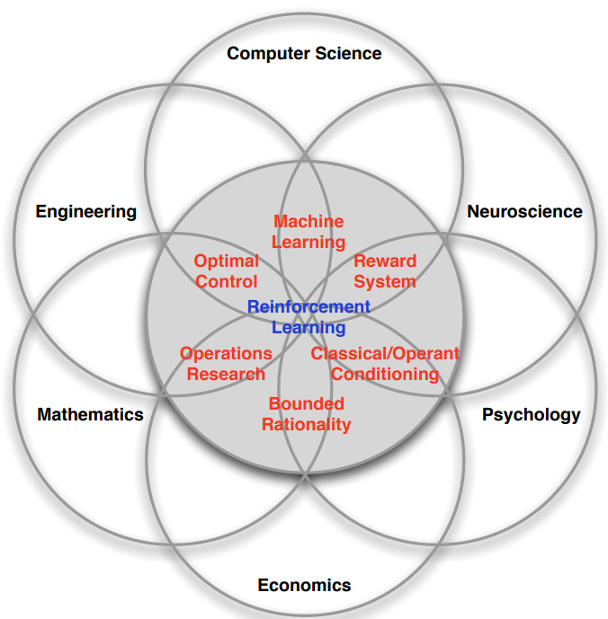
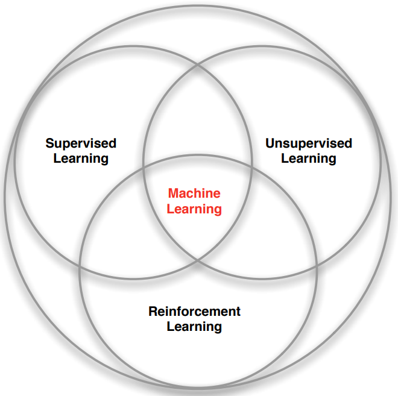

# Outline
1. About Reinforcement Learning
2. The Reinforcement Learning Problem
3. Inside an RL Agent
4. Problems with Reinforcement Learning
# About Reinforcement Learning
### Many Faces of Reinforcement Learning

1. **Reinforcement Learning as a Cross-Disciplinary Field**
    
    - RL is a central topic that connects various scientific domains.
    - It is fundamentally about **decision-making**, making it applicable across multiple areas.
2. **Connections to Other Fields:**
    
    - **Computer Science:** RL is a subset of **machine learning**, where algorithms learn to make optimal decisions based on rewards.
    - **Engineering:** RL overlaps with **optimal control**, which focuses on determining the best sequence of actions to achieve desired outcomes.
    - **Neuroscience:**
        - The **dopamine system** in the human brain closely mirrors RL algorithms.
        - Research suggests that RL principles underlie human decision-making processes.
    - **Psychology:**
        - Concepts like **classical conditioning** (Pavlov) and **operant conditioning** (Skinner) align with RL, explaining how behaviors emerge through reinforcement.
    - **Mathematics:** RL has strong ties to **operations research** and **optimal control theory**, where mathematical models optimize decisions.
    - **Economics:**
        - RL is linked to **game theory**, **utility theory**, and **bounded rationality**, which explore decision-making strategies under constraints.
3. **The Fundamental Nature of Reinforcement Learning**
    
    - RL is a **universal framework for decision-making** across disciplines.
    - The study of RL helps understand how both artificial systems and biological organisms make decisions to maximize rewards.

### Branches of Machine Learning

### Characteristics of Reinforcement Learning

1. **No Supervisor in Reinforcement Learning**
    
    - Unlike **Supervised Learning**, where a model is provided with labeled data that explicitly states the correct answer, RL lacks direct supervision.
    - Instead of receiving explicit guidance on what action to take, an RL agent learns through **trial and error**, exploring the environment autonomously.
    - The agent receives only a **reward signal** that indicates whether an action was beneficial or harmful but does not specify the best possible action.
    - Example: Instead of being told “Turn left,” an agent might receive a reward of **+3 points** for a correct move or **-10 points** for a mistake, but it has to figure out why.
2. **Delayed Feedback**
    
    - In **Supervised Learning**, feedback is immediate—errors in prediction are corrected instantly based on labeled data.
    - In **RL**, feedback (i.e., rewards or penalties) may come **many steps later**, making it harder to associate actions with their consequences.
    - Example: A chess-playing RL agent might make a move that seems good at the moment but only realizes much later that it was a mistake when it leads to checkmate.
3. **Sequential Decision-Making**
    
    - Unlike **Supervised Learning**, where each data point is independent (**IID - Independently and Identically Distributed**), RL involves **sequential** decisions where previous actions affect future ones.
    - The agent interacts with the environment **over time**, making decisions that influence subsequent states.
    - Example: A self-driving car must continuously make decisions about steering, acceleration, and braking, where each choice affects its future state.
4. **Non-IID Data and Correlated Observations**
    
    - In **Supervised Learning**, data is typically assumed to be IID (independent of other samples).
    - In RL, however, **each observation is correlated with previous ones**.
    - Example: If a robot is walking, what it sees in one moment is closely related to what it sees in the next second. This makes it difficult to use traditional learning assumptions.
5. **Agent Actively Influences the Data It Receives**
    
    - Unlike a passive machine learning model that learns from a fixed dataset, an RL agent **actively changes its environment** by taking actions.
    - The data it encounters depends on **what it has done previously**.
    - Example: If a robot moves to a different side of a room, it will see different objects, receive different rewards, and gather a **different dataset** from what it would have seen had it stayed in place.
6. **Active Learning and Optimization Over Time**
    
    - RL involves **active learning**, where the agent must explore different strategies before finding the most optimal one.
    - Instead of simply classifying images or predicting values, RL agents must **continuously improve** through experience, refining their strategy based on rewards received over time.
    - Example: A video game AI might initially make random moves but gradually learns the best tactics to maximize its score.
### Examples of Reinforcement Learning

1. **Helicopter Stunt Maneuvers:**
    
    - A helicopter performs complex stunts based on reinforcement learning.
    - There is no immediate feedback after every move, but success is determined at the end of the maneuver.
    - Crashing is considered a failure, reinforcing the need for precise learning.
2. **Backgammon AI Success:**
    
    - Jerry Taro’s RL model defeated the human world champion in Backgammon.
    - The AI learned to play by repeated trial and error, gradually improving its strategy.
3. **Investment Portfolio Management:**
    
    - An RL model makes real-time investment decisions based on incoming data.
    - The reward function is based on maximizing financial returns over time.
    - The model learns optimal investment strategies through experience.
4. **Power Station Control:**
    
    - RL optimizes control over a power station’s operation.
    - Adjustments include torque control, battery ratios, and blade pitch in wind turbines.
    - The objective is to maximize energy efficiency and output over time.
5. **Humanoid Robot Walking:**
    
    - A robot learns to walk using RL, receiving feedback on whether it falls or moves forward.
    - It refines its movement strategy step by step to reach a goal (e.g., crossing a room).
6. **DeepMind’s Atari Game Agent:**
    
    - A single RL-based agent learns to play multiple Atari games at a superhuman level.
    - The program adapts to different game environments by learning optimal strategies.
**Audience Questions and Lecturer's Response**
1. Question about simulation in Reinforcement Learning
	- Audience: Whether the helicopter reinforcement learning system was trained in a simulated environment
	- Lecturer: Approach involved first building a model of the helicopter's behavior using real-world data. The learning was then done offline using this model before being applied to the actual helicopter.
2. Question about Atari Game Learning
	- Audience: Inquires the reinforcement learning agent playing Atari games
	- Lecturer: The agent learns purely through trial and error. It has no prior knowledge of the game rules and only receives video input and score feedback. Through reinforcement learning, it figures out how to maximize the score without human guidance.
- Question about Knowledge transfer between Atari games
	- Audience: Whether knowledge transfer strategies is applied between Atari games
	- Lecturer: Each game starts fresh, with no knowledge transfer.
Reinforcement learning (RL) is not just about games, though many applications involve games. RL concepts are broadly applicable beyond gaming.
### The Reinforcement Learning Problem
